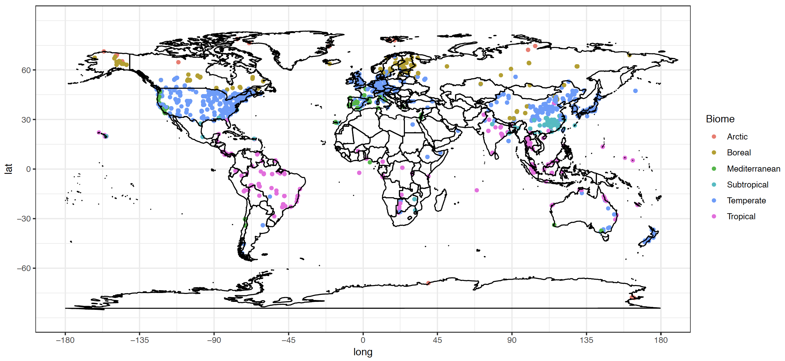
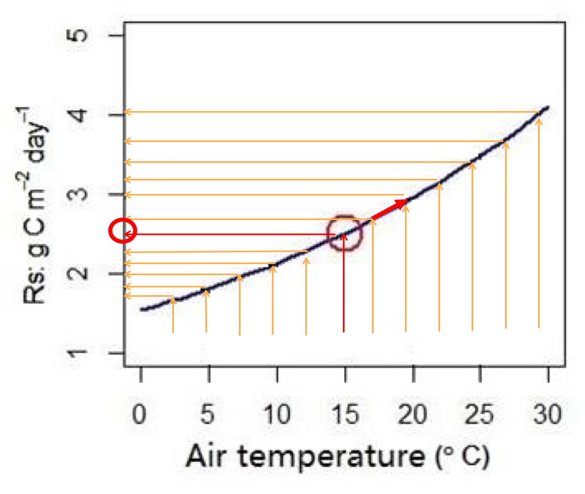
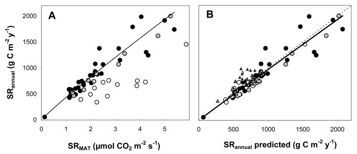

```{r preliminaries, message=FALSE, include=FALSE, echo=FALSE}
# Set chunks defaults; these options will be applied to all subsequent chunks
knitr::opts_chunk$set(results = 'hide', message = TRUE, include = TRUE, echo = FALSE,
                      fig.height = 5, fig.width = 7)

# Constants
OUTPUT_DIR		<- "outputs/"
LOG_DIR			<- "logs/"
SEPARATOR		<- "-------------------------------------------"
# SCRIPT			<- "6-bahn_analysis.Rmd"
INFN 			<- "MGRsD-data-v4-TSoil.csv"
OUTFN 			<- "MGRsD-data-final.csv"
TDIFF_MAX 		<- 2	# max diff allowed btwn global dataset TAIR and observed
OUTCLIMDATA     <- "summarized_climate.csv"

# Create output and log folders if they do not exist
if(!file.exists(OUTPUT_DIR)) dir.create(OUTPUT_DIR)
if(!file.exists(LOG_DIR)) dir.create( LOG_DIR )

# install.packages('cowplot')
# Load required packages
library(cowplot)
library(data.table)
library(dplyr)
library(ggplot2)
theme_set(theme_bw())
library(lubridate)
library(kableExtra)
library(cowplot)
library(knitr)
library("ggpubr")
library(reshape)

# Source all needed functions
source('0-Basic_functions.R')
source('6-bahn_Analysis_functions.R')
source('2.0-bahn_processing.R')

```


```{r, message='hide'}
# calculate Rs_annual_bahn based on mean annual soil temperature, TAnnual, and MAT
# Load data
OUTCLIMDATA     <- paste0( "summarized_climate.csv" )
srdb_orig <- read.csv( INFN, stringsAsFactors=F )
srdb_orig$TAIR_LTM_dev <- with( srdb_orig, abs( MAT_Del - MAT ) )
srdb_orig$TAIR_dev <- with( srdb_orig, abs( TAnnual_Del - Study_temp ) )
conversions <- read.csv( paste( "srdb-conversions.csv", sep="/" ), stringsAsFactors=F )

printlog( "Reading", INFN )
# printdims( srdb_orig )
# colnames( srdb_orig )

# three MAT_Del na values were replaced by MAT reported from paper
srdb_orig[is.na(srdb_orig$MAT_Del), colnames(srdb_orig)=='MAT_Del'] <- 
  srdb_orig[is.na(srdb_orig$MAT_Del), colnames(srdb_orig)=='MAT']

# Using TAnnual predict Rs_MAT
srdb_orig <- compute_rs_mat( srdb_orig, "TAnnual_Del")
colnames(srdb_orig)[(length(colnames(srdb_orig))-3):length(colnames(srdb_orig))] <- c("mtr_out_TAnnual", "Rs_TAIR_units_TAnnual", "Rs_TAIR_TAnnual", "Rs_annual_bahn_TAnnual")

# Using MAT predict Rs_MAT
srdb_orig <- compute_rs_mat( srdb_orig, "MAT_Del")
colnames(srdb_orig)[(length(colnames(srdb_orig))-3):length(colnames(srdb_orig))] <- c("mtr_out_MAT", "Rs_TAIR_units_MAT", "Rs_TAIR_MAT", "Rs_annual_bahn_MAT")

# Using mean annual soil temperature predict Rs_MAT
srdb_orig <- compute_rs_mat( srdb_orig, "Study_TS_Annual")

srdb_orig <- srdb_orig[!is.na(srdb_orig$Rs_annual_bahn),]
srdb <- srdb_orig
# srdb_orig <- srdb
```


# 1. The spatial distribution of global Rs sites 

* In daily and monthly time scale, we used this approach a lot
```{r}
Rs_mat_Rs_diurnal()
```


* We have much more measurements Rs in mid-latitude regions, where developed countries are mostly located
* It is difficult to measure soil respiration all year around in cold regions, but critical because of high rates of climate change and large soil C stocks
* Less-developed countries are constrained by lack of resources, and thus we do not have enough measurements from tropical regions [(Xu and Shang 2016)](http://dx.doi.org/10.1016/j.jplph.2016.08.007)



Rs data from cold regions are more important, but how to increase the number of measurements?
* Make equipment work normally in very cold and remote conditions
* Increase resources devoted to Rs measurements
* Methodological improvements: for instance, measuring once per day to get daily mean



* Measure once per year to get annual Rs mean? This is **Bahn's approach** [Bahn et al. (2004) Biogeosciences](http://dx.doi.org/10.5194/bg-7-2147-2010)



* Rs measured at annual mean temperature is ~~linearly~~ related with annual Rs rate
* Rs at mean temperature: soil respiration measured at annual mean temperature, monthly mean temperature, and/or daily mean temperature
* `Rs_annual` ~ `Rs_mat` ("Rs_bahn")
* `Rs_annual` = 455.8 * `Rs_mat`^1.0054 (R^2^ = 0.94, p<0.001)

# 2. The objects of this analysis are
* Examine whether Rs measured at annual mean soil temperature can represent annual Rs rate? (We now have an order of magnitude more data than Bahn et al.)
* Annual mean air temperature (e.g., average of 12 monthes' air temperature of 2000) / Mean annual air temperature (1964-2014)
* If not, when and what is the mechanism?
* Update the model?

# 3. Methods

**Data**

* Use SRDB_V4 -- `Rs_Annual`
* Annual mean soil temperature (reported in the papers or can be calculated with simple assumptions)
* Relationship between Rs and soil temperature (SRDB_V4)
* Air temperature (University of Daleware global precipitation and air temperature data, 1964-2014, half degree spatial resolusion)
* 823 records from 253 studies

```{r 3.1.1 MAP from Delaware vs MAP from paper, warning = FALSE}

climate_Del_test()

```


**Statistics**

* According the the relationship between Rs and Ts, we can estimate `Rs_mat` based on the annual mean soil temperature, T_Annual, and/or MAT
* Use the Bahn Biogeoscience model (Rs_annual = 455.8 * Rs_mat^1.0054) to predict `Rs_annual` based on `Rs_mat`
* Comparing `Rs_annual` and `Rs_annual_bahn` to evaluate the performance of Bahn model across the global

**Update Bahn's model**

* If Bahn (2010) model does not predict Rs_annual in all conditions
* Update Bahn (2010) model (e.g., including drought parameter, other parameters?)
* Regression tree modeling?


```{r 3.1.2 Coverage of MAP and MAT, message=FALSE, warning=FALSE}
figA <- climate_figure( srdb_orig )
```


## 3.2 test the relationship between Rs_annual and Rs_mat
```{r 3.2 Rs_annual vs Rs_mat, results='show'}
# Report updated values for Bahn (2010) relationship based on SRDB
compare_Rs_annual_Rs_TAIR( srdb_orig )

# test intercept

```


## 3.3 Ts sources (MGRsD, MGRsD_TAIR, From paper, Rs_Ts_relationship)

```{r 3.3 Ts sources and effect}
# Does TS source afffects result, function 3.2
fig_Ts <- TS_Source_test(srdb)
```

## 3.4 Annual Rs or Ts coverage effect

```{r 3.4.0 Rs or Ts coverage and effect}
# What's the effect of annual coverage?
# Changed function so it can test both Rs_coverage and TS coverage
plot_grid(AC_test( srdb, srdb$Annual_TS_Coverage, var_title = 'Test Ts coverage' )
          , AC_test( srdb, srdb$Annual_coverage, var_title = 'Test Rs coverage' ))

```

## 3.4.1 Test whether outliers affect the regression (need update)
* Conclusion: need to update the code and results 
# moved to section 4.1


## 3.4.2 Effect of maximum allowed divergence between global climate data set and site-specific air temperature

* Does TAIR_dev and TAIR_LT<_dev affect the relationship -- YES!!!!!
* TAIR_LTM_dev = with( srdb, abs( MAT_Del - MAT ) )
* Does TAIR_LTM_dev () pull the slope off 1? -- YES!!!!!
* TAIR_dev <- with( srdb, abs( TAnnual_Del - Study_temp ) )
* Figure E. Effect of maximum allowed divergence between global climate data set and site-specific air temperature, when given. As we throw out data points with high divergence, R2 goes up (top panel) and RSE goes down (bottom, g C m-2 yr-1).


```{r 3.4.2 test divergence, fig.height= 8, fig.width=4}
results <- data.frame()
for( i in c( 6, 4, 2, 1, 0.5, 0.25 ) ) {
  dat <- filtration3( srdb_orig, i, quiet=T )
  m <- lm(Rs_annual ~ Rs_annual_bahn, data = dat)
  results <- rbind(results, data.frame(  tdiff_max=i,
                           inter <- round(summary( m )$coefficients[1,1],2),
                           p_inter <- round(summary(m)$coefficients[1,4],4),
                           slope <- round(summary( m )$coefficients[2,1],4),
                           p_slope <- round(summary(lm( Rs_annual_bahn - 1*Rs_annual ~ Rs_annual
                                                        , data = dat ))$coefficients[2,4],4),
                           R2 = round(summary( m )$adj.r.squared,2), 
                           RSE = round(summary( m )$sigma,2 ),
                           n <- length(dat[,1])
                           ) ) 
}

printlog( SEPARATOR )
colnames(results) <- c("TAIR_LTM_dev", 'intercept', "p(intercept)", 'slope', "p(slope)", 'R2', 'MSE', 'n')
print( results )
results <- results[, 1:7]
d <- melt( results, id.vars=1 )
p <- qplot( TAIR_LTM_dev, value, data=d, geom=c( "point", "line" ) ) +
  facet_grid( variable~., scales = "free" ) + 
  xlab( expression('Absolute diff between TAIR_Del and temp from paper (' * degree~C * ")") ) + 
  ggtitle ('Test effects of temperature difference between paper \nreported TAIR and TAIR from Delaware climate data')
print( p )
```


## 3.4.3 Effect of maximum allowed divergence between annual precipitation from paper and Del

```{r 3.4.3 test precipitation divergence, fig.height=8, fig.width=4}
results <- data.frame()
for( i in c( seq(50, 3000, 200) ) ) {
  dat <- filtration4( srdb_orig, i, quiet=T )
  m <- lm(Rs_annual ~ Rs_annual_bahn, data = dat)
  results <- rbind(results, data.frame(  pdiff_max=i,
                           inter <- round(summary( m )$coefficients[1,1],2),
                           p_inter <- round(summary(m)$coefficients[1,4],4),
                           slope <- round(summary( m )$coefficients[2,1],4),
                           p_slope <- round(summary(lm( Rs_annual_bahn - 1*Rs_annual ~ Rs_annual, data = dat ))$coefficients[2,4],4),
                           R2 = round(summary( m )$adj.r.squared,2), 
                           RSE = round(summary( m )$sigma,2 ),
                           n <- length(dat[,1])
                           ) ) 
}

printlog( SEPARATOR )
colnames(results) <- c("PRECIP_MAP_dev", 'intercept', "p(intercept)", 'slope', "p(slope)", 'R2', 'MSE', 'n')
print( results )
results <- results[, 1:7]
d <- melt( results, id.vars=1 )
p <- qplot( PRECIP_MAP_dev, value, data=d, geom=c( "point", "line" ) ) +
  facet_grid( variable~., scales = "free" ) + 
  xlab('Absolute diff between TAIR_Del and temp from paper (mm)' ) +
  ggtitle ('Test whether difference tetween precipitation \nrelorted in paper and from Delaware has effect')
print( p )
```


# 4. Results

## 4.1 Using Ts, TAnnual or MAT
### 4.1.1 Using soil temperature

```{r 4.1 test outlier, warning=FALSE, fig.width=8}
# srdb_01 <- filtration1(srdb_orig)
# figB_01 <- Rs_comparion_figure( srdb_orig, name = '3.4.1_Test outlier', var_title = "Test outliers" )
Rs_annual_bahn_test(srdb_orig, 'Rs_annual_bahn', var_title = 'Rs_annual vs Rs_annual_bahn', res_title = 'Residual plot')
```


### 4.1.2 Using T_Annual

```{r, warning=FALSE}
# TAnnual, function 
Rs_annual_bahn_test(srdb, temp = 'Rs_annual_bahn_TAnnual', var_title = 'Rs_annual vs Rs_annual_bahn', res_title = 'Residual plot')
```

### 4.1.3 Using MAT

```{r, warning=FALSE}
# MAT, function 
Rs_annual_bahn_test(srdb, 'Rs_annual_bahn_MAT', var_title = 'Rs_annual vs Rs_annual_bahn', res_title = 'Residual plot')
```


## 4.2 Analysis when Rs_mat cannot represent Rs_annual

## 4.2.2 Does Ecosystem_type affect the relationship between Rs_annual and Rs_mat?

```{r filtration_mk, fig.height = 8, fig.width = 4}
var_eco <- sort(unique(srdb$Ecosystem_type)) # only two desert records
var_eco <- var_eco[c(-2,-5, -6)] # Dsert, savana and natural only less than three data points available
# create a data frame hold regression results for removed certain ecosystem type and specific ecosystem alone
# srdb_mv_ag <- filtration_mv ( srdb_orig, 'Agriculture' ) # agriculture as example
# figB_mv_ag <- Rs_comparion_figure( srdb_mv_ag )          # agriculture as example
# c("mama.log", "papa.log", "mimo.png", "mentor.log") %>% .[grepl("^m.*\\.log$", .)]

out <- data.frame()

for (i in 1:length (var_eco)) {
  # a specific ecosystem removed 
  srdb_mv_eco <- filtration_mk ( srdb_orig, fil_type = srdb_orig$Ecosystem_type, var = var_eco[i], mk = T )
  lm_mv <- lm(Rs_annual ~ Rs_annual_bahn  , data = srdb_mv_eco) #unique(srdb_mv_eco$Ecosystem_type)
  R2_mv <- round(summary(lm_mv)$r.squared, 2)
  slope_mv <- round(lm_mv$coefficients[2], 2)
  p_slope_mv <- round(summary( lm( Rs_annual_bahn - 1 * Rs_annual ~ Rs_annual, data=srdb_mv_eco ) )$coefficients[ 2, 4 ], 4)
  intercept_mv <- round(lm_mv$coefficients[1], 2)
  p_intercept_mv <- round(summary(lm_mv)$coefficients[ 1, 4 ],4)
  # rmse_mv <- mean(lm_mv$residuals^2)^0.5
  mse_mv <- round(summary(lm_mv)$sigma,2)
  n_mv <- length(srdb_mv_eco$Record_number)
 
  # eco alone  
  srdb_kp_eco <- filtration_mk ( srdb_orig, fil_type = srdb_orig$Ecosystem_type, var = var_eco[i], mk = F )
  lm_kp <- lm(Rs_annual ~ Rs_annual_bahn  , data = srdb_kp_eco)
  R2_kp <- round(summary(lm_kp)$r.squared, 2)
  slope_kp <- round(lm_kp$coefficients[2], 2)
  p_slope_kp <- round(summary( lm( Rs_annual_bahn - 1 * Rs_annual ~ Rs_annual, data=srdb_kp_eco ) )$coefficients[ 2, 4 ], 4)
  intercept_kp <- round(lm_kp$coefficients[1], 2)
  p_intercept_kp <- round(summary(lm_kp)$coefficients[ 1, 4 ], 4)
  # rmse_kp <- mean(lm_kp$residuals^2)^0.5
  mse_kp <- round(summary(lm_kp)$sigma,2)
  n_kp <- length(srdb_kp_eco$Record_number)
  
  # put data in table
  out <- rbind(out, data.frame( i, var_eco[i], R2_mv, slope_mv, p_slope_mv, intercept_mv, p_intercept_mv, mse_mv, n_mv
                , R2_kp, slope_kp, p_slope_kp, intercept_kp, p_intercept_kp, mse_kp, n_kp ) )
 
  
  #for (i in 3:16) { out[,i] <- as.factor(out[,i]) } why does not work
  #class(out[,4])
  # out <- matrix(data=out, ncol=16, nrow=5)
  # sapply(out, class)
  
}

colnames(out) <- c( "ID", "Ecosystem", "R2_mv", "Slope_mv", "p_slope_mv", "intercept_mv", "p_intercept_mv", "MSE_mv", "n_mv"
                   , "R2_kp", "Slope_kp", "p_slope_kp", "intercept_kp", "p_intercept_kp", "MSE_kp", "n_kp" )
out_mv <- out[,c(2:8)]
print(out_mv)
melt_mv <- melt(out_mv, id.vars = 1)
p_mv <- qplot( Ecosystem, value, data=melt_mv, geom=c( "point", "line" ) ) +
  facet_grid( variable~., scales = "free" ) + 
  xlab('Ecosystem type removed' ) + 
  ggtitle('Test when a specific ecosystem type \nremoved from whole dataset')
print( p_mv )

out_kp <- out[,c(2,10:15)]
print(out_kp)
melt_kp <- melt(out_kp, id.vars = 1)
p_kp <- qplot( Ecosystem, value, data=melt_kp, geom=c( "point", "line" ) ) +
  facet_grid( variable~., scales = "free" ) + 
  xlab('Ecosystem type alone' ) + 
  ggtitle('Test when only data from \na specific ecosystem type were kept')
print( p_kp )
```


```{r agriculture, warning=FALSE}
# Take agriculture as an example to test
# Move agriculture from srdb -- no big effect
srdb_mv_ag <- filtration_mk ( srdb_orig, fil_type = srdb_orig$Ecosystem_type, var = 'Agriculture', mk = T )
# figB_mv_ag <- Rs_comparion_figure( srdb_mv_ag, var_title = 'When agriculture data were removed' )
Rs_annual_bahn_test(srdb_mv_ag, 'Rs_annual_bahn', var_title = 'Rs_annual vs Rs_annual_bahn', res_title = 'Residual plot')

# Agriculture alone -- not significant differ
srdb_kp_ag <- filtration_mk ( srdb_orig, fil_type = srdb_orig$Ecosystem_type, 'Agriculture', mk = F )
# figB_kp_ag <- Rs_comparion_figure( srdb_kp_ag, var_title = 'Only data from agriculture used' )
Rs_annual_bahn_test(srdb_kp_ag, 'Rs_annual_bahn', var_title = 'Rs_annual vs Rs_annual_bahn', res_title = 'Residual plot')

```

```{r wetland, warning=FALSE}
# Take wetland as an example to test
# Move wetland from srdb -- no big effect
srdb_mv_wet <- filtration_mk ( srdb_orig, fil_type = srdb_orig$Ecosystem_type, var = 'Wetland', mk = T )
# figB_mv_wet <- Rs_comparion_figure( srdb_mv_wet, var_title = 'When data from wetland were removed' )
Rs_annual_bahn_test(srdb_mv_wet, 'Rs_annual_bahn', var_title = 'Rs_annual vs Rs_annual_bahn', res_title = 'Residual plot')

# Wetland alone -- not significant differ
srdb_kp_wet <- filtration_mk ( srdb_orig, fil_type = srdb_orig$Ecosystem_type, var = 'Wetland', mk = F )
# figB_kp_wet <- Rs_comparion_figure( srdb_kp_wet, var_title = 'Only data from wetland used' )
Rs_annual_bahn_test(srdb_kp_wet, 'Rs_annual_bahn', var_title = 'Rs_annual vs Rs_annual_bahn', res_title = 'Residual plot')
```


## 4.2.3 Does Meas_method affect the relationship?

```{r, warning=FALSE}
# Whether measure method affects
# unique(srdb$Meas_method)
# c( "IRGA", "Gas chromatography", "Gas Chromatography" )
# IRGA method
srdb_mv_IRGA <- filtration_mk ( srdb_orig, fil_type = srdb_orig$Meas_method
                               , var = c( "IRGA", "Gas chromatography", "Gas Chromatography" ), mk = T )
Rs_annual_bahn_test(srdb_mv_IRGA, 'Rs_annual_bahn', var_title = 'Rs_annual vs Rs_annual_bahn', res_title = 'Residual plot')

# Alkaline method
srdb_kp_IRGA <- filtration_mk ( srdb_orig, fil_type = srdb_orig$Meas_method
                               , var = c( "IRGA", "Gas chromatography", "Gas Chromatography" ), mk = F )
Rs_annual_bahn_test(srdb_kp_IRGA, 'Rs_annual_bahn', var_title = 'Rs_annual vs Rs_annual_bahn', res_title = 'Residual plot')

```


### 4.2.4 RA- or RH-dominated effect?
```{r}
# How do autotrophic- versus heterotrophic-dominated systems differ?
# Figure C. Difference between RA-dominated sites (RC_annual>0.5 is TRUE) 
# and RH-dominated ones (RC_annual>0.5 is FALSE).
figC <- RC_test( srdb, var_title = 'Test Ra and Rh dominated sites' )
```

### 4.2.5 Biome effect?

```{r}
# subset(srdb_orig, srdb_orig$Biome == 'Arctic') # only one record
print( summary( lm( Rs_annual ~ Rs_annual_bahn * Biome, data=srdb ) ) )
p <- ggplot( srdb_orig, aes( Rs_annual_bahn, Rs_annual, color= Biome) )
p <- p + geom_point() + ggtitle( 'Test biome effects' )
p <- p + geom_smooth( method='lm' )
p <- p + geom_abline( slope=1, linetype=2 )
print( p )
```


```{r, fig.width=4, fig.height = 8}
# move and keep by Biome
var_filt <- sort(unique(srdb$Biome)) # only two desert records
var_filt <- var_filt[c(-1)] # n_arctic = 1

out <- data.frame()

for (i in 1:length (var_filt)) {
  # a specific ecosystem removed 
  srdb_mv_filt <- filtration_mk ( srdb_orig, fil_type = srdb_orig$Biome, var = var_filt[i], mk = T )
  lm_mv <- lm(Rs_annual ~ Rs_annual_bahn  , data = srdb_mv_filt) #unique(srdb_mv_filt$Biome)
  R2_mv <- round(summary(lm_mv)$r.squared, 2)
  slope_mv <- round(lm_mv$coefficients[2], 2)
  p_slope_mv <- round(summary( lm( Rs_annual_bahn - 1 * Rs_annual ~ Rs_annual, data=srdb_mv_filt ) )$coefficients[ 2, 4 ], 4)
  intercept_mv <- round(lm_mv$coefficients[1], 2)
  p_intercept_mv <- round(summary(lm_mv)$coefficients[ 1, 4 ],4)
  # rmse_mv <- mean(lm_mv$residuals^2)^0.5
  mse_mv <- round(summary(lm_mv)$sigma,2)
  n_mv <- length(srdb_mv_filt$Record_number)
 
  # eco alone  
  srdb_kp_filt <- filtration_mk ( srdb_orig, fil_type = srdb_orig$Biome, var = var_filt[i], mk = F )
  lm_kp <- lm(Rs_annual ~ Rs_annual_bahn  , data = srdb_kp_filt)
  R2_kp <- round(summary(lm_kp)$r.squared, 2)
  slope_kp <- round(lm_kp$coefficients[2], 2)
  p_slope_kp <- round(summary( lm( Rs_annual_bahn - 1 * Rs_annual ~ Rs_annual, data=srdb_kp_filt ) )$coefficients[ 2, 4 ], 4)
  intercept_kp <- round(lm_kp$coefficients[1], 2)
  p_intercept_kp <- round(summary(lm_kp)$coefficients[ 1, 4 ], 4)
  # rmse_kp <- mean(lm_kp$residuals^2)^0.5
  mse_kp <- round(summary(lm_kp)$sigma,2)
  n_kp <- length(srdb_kp_filt$Record_number)
  
  # put data in table
  out <- rbind(out, data.frame( i, var_filt[i], R2_mv, slope_mv, p_slope_mv, intercept_mv, p_intercept_mv, mse_mv, n_mv
                , R2_kp, slope_kp, p_slope_kp, intercept_kp, p_intercept_kp, mse_kp, n_kp ) )
 
  
  #for (i in 3:16) { out[,i] <- as.factor(out[,i]) } why does not work
  #class(out[,4])
  # out <- matrix(data=out, ncol=16, nrow=5)
  # sapply(out, class)
  
}

colnames(out) <- c( "ID", "Biome", "R2_mv", "Slope_mv", "p_slope_mv", "intercept_mv", "p_intercept_mv", "MSE_mv", "n_mv"
                   , "R2_kp", "Slope_kp", "p_slope_kp", "intercept_kp", "p_intercept_kp", "MSE_kp", "n_kp" )
out_mv <- out[,c(2:8)]
print(out_mv)
melt_mv <- melt(out_mv, id.vars = 1)
p_mv <- qplot( Biome, value, data=melt_mv, geom=c( "point", "line" ) ) +
  facet_grid( variable~., scales = "free" ) + 
  xlab('Biome type removed' ) + ggtitle('Test when a specific biom was removed')
print( p_mv )

out_kp <- out[,c(2,10:15)]
print(out_kp)
melt_kp <- melt(out_kp, id.vars = 1)
p_kp <- qplot( Biome, value, data=melt_kp, geom=c( "point", "line" ) ) +
  facet_grid( variable~., scales = "free" ) + 
  xlab('Biome type alone' ) + ggtitle('Only data from a specific biom used')
print( p_kp )
```

## 4.2.6 TAIR and precipitation variability effect?

```{r}
# How much variability is due to inaccuracies in the global TAIR data?
# Do ecosystems with more-variable climates exhibit different trends?
climate_variability_test( srdb, var_title_T = 'Test TAIR variability'
                          , var_title_P = 'Test precipitation variability' )
```


## 4.2.7 Drought effect?

```{r, warning=FALSE, fig.width=8}
climate_MAP_test (srdb, 'Test MAP', 'Residual plot')
```

```{r, fig.height=12, fig.width=5}
# Does drought affects trends?
SPI_test( srdb, 'Test SPI' ) #SPI can identify the drout of a year compare to the past 50 years (1964-2014)
```


```{r, fig.height=12, fig.width=5}
# Do drought effects different trends?
PDSI_test( srdb, 'Test PDSI' ) # need a new SPI data
```


# 5. Discussion & questions


# 6. More analysis in the future

* 1 Using SD information with boosting?
* 2 Use Rs_mat predict Rh?
* 3 Use this approach estimate global Rs
* 4 Think about application
* 5 Update bahn model with more predictors or using regression tree method?

```{r quality check by study ID}
# subtest_1(5227)
```
