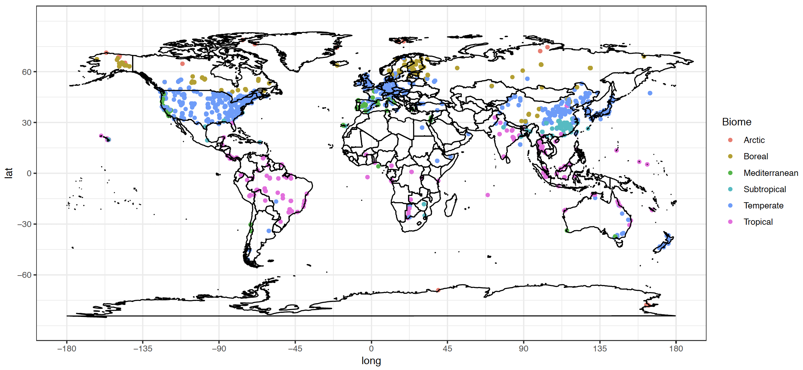

------------------------------
title: "Bahn analysis report"
author: "Jinshi"
date: "March 26, 2019"
output:
  html_document:
    df_print: paged
------------------------------


```{r, results='hide', message=FALSE, include=FALSE, echo=FALSE}
# set up work direction
R_dir <- '/Users/jian107/PNNL/bahn-rs-test/RTSoil'
setwd(R_dir)
getwd()
```


```{r, results='hide', message=FALSE, include=FALSE, echo=FALSE}
# create variables
OUTPUT_DIR		<- "outputs/"
LOG_DIR			<- "logs/"
SEPARATOR		<- "-------------------+++++-------------------"

SCRIPT			<- "3-bahn_analysis.R"
INFN 			<- "MGRsD-data-processed.csv"
OUTFN 			<- "MGRsD-data-final.csv"
TDIFF_MAX 		<- 2	# max diff allowed btwn global dataset TAIR and observed
```


```{r ,results='hide', message=FALSE, include=FALSE, echo=FALSE} 
# source all functions from 6-bahn_Analysis_function
source('6-bahn_Analysis_functions.R')
```


```{r, results='hide', message=FALSE, include=FALSE, echo=FALSE}
# load package
library('data.table')
library('sqldf')
library('data.table')
library("gridExtra")
loadlibs( c( "ggplot2", "reshape" ) )
```

```{r, results='hide', echo=FALSE}
# load data
OUTCLIMDATA     <- paste0( "summarized_climate.csv" )
srdb_orig <- read.csv( INFN, stringsAsFactors=F )
srdb <- srdb_orig
```


# 1. The spatial destribution of global Rs sites 
* We have much more measured Rs from the middle latitude region
* It is difficult to measure soil respiration all year around in the cold region
* Developed contries most located at Middle latitude region, thus recieved more funds to support the Rs measurements 



# 2. It is obvious that Rs measurements from cold region is more importent, but how?
Improve the Rs measure equipment so it can measure Rs in cold condition;
Increasing funds;
**Bahn's approach** [Bahn et al. (2004) Biogeosciences]
+ Rs measured at annuam mean temperature linearly related with annual Rs rate
+ Rs at mean temperature: soil respiration measured at annual mean temperature / monthly mean temperature / daily mean temperature

# 3. The object of this analysis are
* Whether Rs measured at annuam mean temperature can represent annual Rs rate
* Whether Rs measured at monthly mean temperature can represent monthly mean Rs?
* Whether Rs measured at daily mean temperature represent daily mean Rs?

* When well represent and when not?
* If not what is the mechanism?

# 4. Results


```{r, results='hide', echo=FALSE}
# main function 1 -- create outputs and log folder if not exist
if( !file.exists( OUTPUT_DIR ) ) {
	# printlog( "Creating", OUTPUT_DIR )
	dir.create( OUTPUT_DIR )
}
if( !file.exists( LOG_DIR ) ) {
	# printlog( "Creating", LOG_DIR )
	dir.create( LOG_DIR )
}
```


## 4.1 Data used from SRDB_V4
* Climate space figure

```{r include=TRUE, results='hide', echo=FALSE}
figA <- climate_figure( srdb_orig )
```

### 4.2.1 Overall results

```{r, results='hide', message=TRUE, include=TRUE, echo=FALSE}
# relationship between reported Rs_Annual and calculated Rs_Annual based on the model from paper
srdb$TS_Source2 <- 
  ifelse( srdb$TS_Source == 'Rs_Ts_Relationship', "Rs Ts Relationship"
          , ifelse(srdb$TS_Source == 'MGRsD', "From MGRsD",
                   ifelse(grepl("TAIR_Del", srdb$TS_Source, fixed = TRUE) , 'TAIR_Del', "From Paper" ) )  )

p <- qplot(Rs_TAIR*365/0.9645, Rs_annual, data=srdb, color = TS_Source2)
p <- p + geom_smooth( method='lm' ) + geom_abline( linetype=2 ) + 
  xlab (expression ("Annual Rs predicted by model using TS (g C/ m"^2*"/yr)")) +
  ylab (expression ("Reported annual Rs (g C/m"^2*"/yr)"))
print( p )
# subset(srdb, srdb$TS_Source2 == 'Rs Ts Relationship')
print( summary( lm( Rs_annual ~ Rs_TAIR + TS_Source2 + Rs_TAIR * TS_Source2, data=srdb ) ) )
```

### 4.2.2 Does TS_Source have effect?
```{r, results='hide', message=TRUE, include=TRUE, echo=FALSE}
# Does TS source afffects result
# length(srdb[srdb$TS_Source %like% "^TAIR_Del",1])
# sqldf( "SELECT TS_Source FROM srdb WHERE TS_Source LIKE '%TAIR_Del' ")
# filter(subset(srdb, select = 'TS_Source'), grepl("TAIR_Del", srdb$TS_Source, fixed = TRUE))
fig_Ts <- TS_Source_test(srdb)
```


### Using soil temperature

```{r, message=TRUE, include=TRUE, echo=FALSE }
# See how Rs_annual is related to Rs_annual_bahn_Temp
TSTSMAT_test(srdb, srdb$Rs_annual_bahn, panel_lab = '(a) TS as predictor')
test_TS <- Rs_annual_bahn_test(srdb, srdb$Rs_annual_bahn)
m_TS <- test_TS[[ 1 ]]
m1_TS <- test_TS[[ 2 ]]
intercept_test <- summary( m_TS )$coefficients[ 1, 4 ]
slope_test <- summary( m1_TS )$coefficients[ 2, 4 ]
intercept_test
slope_test
```

### Using T_Annual
```{r, message=TRUE, include=TRUE, echo=FALSE}
# TAnnual
TSTSMAT_test(srdb, srdb$Rs_annual_bahn_TAnnual, panel_lab = '(b) T_Annual as predictor')
test_TAnnual <- Rs_annual_bahn_test(srdb, srdb$Rs_annual_bahn_TAnnual)
m_TAnnual <- test_TAnnual[[ 1 ]]
m1_TAnnual <- test_TAnnual[[ 2 ]]
intercept_test <- summary( m_TAnnual )$coefficients[ 1, 4 ]
slope_test <- summary( m1_TAnnual )$coefficients[ 2, 4 ]
intercept_test
slope_test

```

### Using MAT
```{r, message=TRUE, include=TRUE, echo=FALSE}
# MAT
TSTSMAT_test(srdb, srdb$Rs_annual_bahn_MAT, panel_lab = '(c) MAT as predictor')
test_MAT <- Rs_annual_bahn_test(srdb, srdb$Rs_annual_bahn_MAT)
m_MAT <- test_MAT[[ 1 ]]
m1_MAT <- test_MAT[[ 2 ]]
intercept_test <- summary( m_MAT )$coefficients[ 1, 4 ]
slope_test <- summary( m1_MAT )$coefficients[ 2, 4 ]
intercept_test
slope_test
```


## 4.3 Main figure comparing Rs_annual with Rs_annual_bahn After filtration
## 4.3.1 Does the extreme values (>3000) pull the slope off 1?

```{r, results='hide', message=TRUE, include=TRUE, echo=FALSE}
srdb_01 <- filtration1( srdb_orig )
figB_01 <- Rs_comparion_figure( srdb_01 )
test_TS <- Rs_annual_bahn_test(srdb_01, srdb_01$Rs_annual_bahn)
m_TS <- test_TS[[ 1 ]]
m1_TS <- test_TS[[ 2 ]]
intercept_test <- summary( m_TS )$coefficients[ 1, 4 ]
slope_test <- summary( m1_TS )$coefficients[ 2, 4 ]
intercept_test
slope_test
```

## 4.3.2 Does agriculture pull the slope off 1?

```{r, results='hide', message=TRUE, include=TRUE, echo=FALSE}
srdb_mv_ag <- filtration_mv ( srdb_orig, 'Agriculture' )
figB_mv_ag <- Rs_comparion_figure( srdb_mv_ag )
```

```{r, results='hide', message=TRUE, include=TRUE, echo=FALSE}
srdb_kp_ag <- filtration_kp ( srdb_orig, 'Agriculture' )
figB_kp_ag <- Rs_comparion_figure( srdb_kp_ag )
```

## 4.3.3 Does wetland pull the slope off 1?
```{r, results='hide', message=TRUE, include=TRUE, echo=FALSE}
unique(srdb$Ecosystem_type)
srdb_mv_eco <- filtration_mv ( srdb_orig, 'Wetland' )
figB_mv_eco <- Rs_comparion_figure( srdb_mv_ag )
```

```{r, results='hide', message=TRUE, include=TRUE, echo=FALSE}
srdb_kp_eco <- filtration_kp ( srdb_orig, 'Wetland' )
figB_kp_eco <- Rs_comparion_figure( srdb_kp_eco )
```

## 4.3.4 Does desert pull the slope off 1?
* Only two data points available
```{r, results='hide', message=TRUE, include=TRUE, echo=FALSE}
unique(srdb$Ecosystem_type)
srdb_mv_eco <- filtration_mv ( srdb_orig, 'Desert' )
figB_mv_eco <- Rs_comparion_figure( srdb_mv_ag )
```

```{r, results='hide', message=TRUE, include=TRUE, echo=FALSE}
srdb_kp_eco <- filtration_kp ( srdb_orig, 'Desert' )
figB_kp_eco <- Rs_comparion_figure( srdb_kp_eco )
```

## 4.3.5 Does Meas_method pull the slope off 1?
```{r, results='hide', message=TRUE, include=TRUE, echo=FALSE}
unique(srdb$Meas_method)
srdb_method1 <- subset( srdb, Meas_method %in% c( "IRGA", "Gas chromatography" ) )
fig_method_IRGA_GC <- Rs_comparion_figure(srdb_method1)
srdb_method2 <- subset( srdb, Meas_method %!in% c( "IRGA", "Gas chromatography") )
fig_method_other <- Rs_comparion_figure(srdb_method2)
```

## 4.3.6 Does TAIR_LTM_dev () pull the slope off 1? -- YES!!!!!
```{r}
srdb_mat <- subset( srdb, TAIR_LTM_dev <= 2 )
srdb_mat2 <- subset( srdb, TAIR_dev <= 2 )
```

## 4.3.6 Does TAIR_dev () pull the slope off 1? -- YES!!!!!

```{r, results='hide', message=TRUE, include=TRUE, echo=FALSE}
srdb_03 <- filtration3( srdb_orig, 0.6 )
figB_03 <- Rs_comparion_figure( srdb_03 )
test_TS <- Rs_annual_bahn_test(srdb_03, srdb_03$Rs_annual_bahn)
m_TS <- test_TS[[ 1 ]]
m1_TS <- test_TS[[ 2 ]]
intercept_test <- summary( m_TS )$coefficients[ 1, 4 ]
slope_test <- summary( m1_TS )$coefficients[ 2, 4 ]
intercept_test
slope_test
```

## 4.4 RA or RH dominated sites differ?
```{r, results='hide', message=TRUE, include=TRUE, echo=FALSE}
# How do autotrophic- versus heterotrophic-dominated systems differ?
# Figure C. Difference between RA-dominated sites (RC_annual>0.5 is TRUE) 
# and RH-dominated ones (RC_annual>0.5 is FALSE).
figC <- RC_test( srdb )
```

## 4.5 Annual Rs or Ts coverage effect
```{r, results='hide', message=TRUE, include=TRUE, echo=FALSE}
# What's the effect of annual coverage?
# Changed function so it can test both Rs_coverage and TS coverage
AC_test( srdb, srdb$Annual_TS_Coverage, 'TS_coverage' )
AC_test( srdb, srdb$Annual_coverage, 'Rs_coverage' )

```

## 4.6 TAIR and precipitation variability affect?
```{r, results='hide', message=TRUE, include=TRUE, echo=FALSE}
# How much variability is due to inaccuracies in the global TAIR data?
# Do ecosystems with more-variable climates exhibit different trends?
climate_variability_test( srdb )
```

## 4.7 Does drought affect?
```{r, results='hide', message=TRUE, include=TRUE, echo=FALSE}
# Do drought effects different trends?
SPI_test( srdb ) # need a new SPI data
```

## 4.8 test the relationship between Rs_annual and Rs_mat
```{r, message=TRUE, include=TRUE, echo=FALSE}
# Report updated values for Bahn (2010) relationship based on SRDB
compute_Rs_annual_bahn( srdb )
```


# 5. Monthly and daily results


# 6. More analysis in the future
* 1 T&Drought function (Maybe use PDSI)
* 2 seprete out Agriculture & Wetland
* 3 Using SD information with boosting?
* 4 Use Rs_mat predict Rh?
* 5 Use this approach estimate global Rs
* 6 Think about application

```{r, message=TRUE, include=TRUE, echo=FALSE}
# subtest_1(5227)
```

